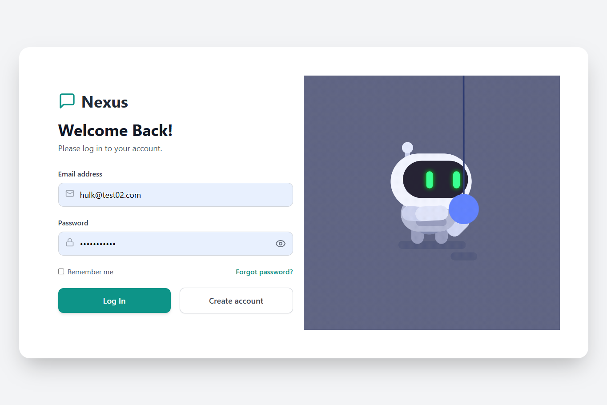
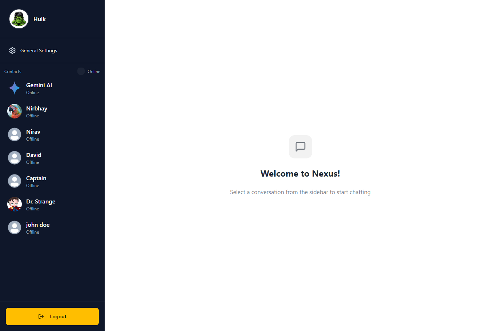
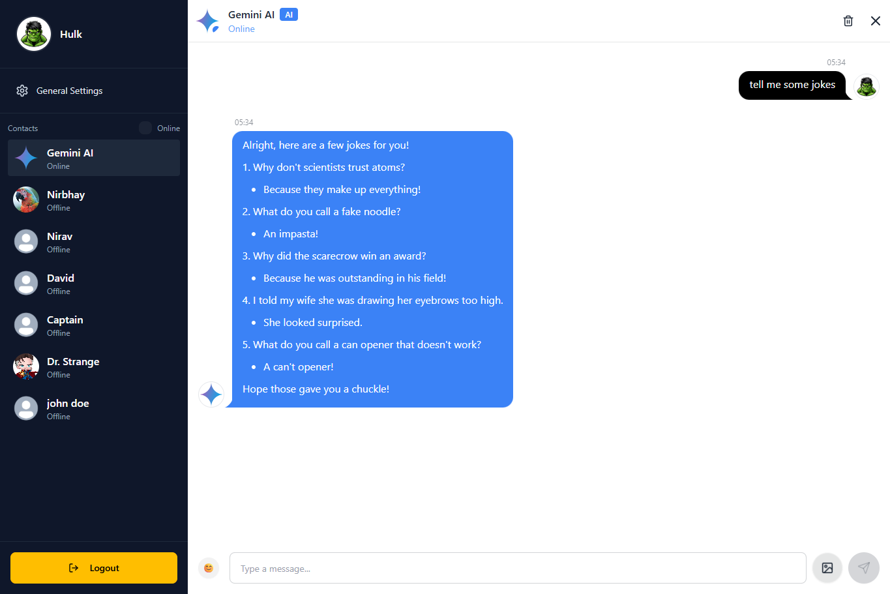
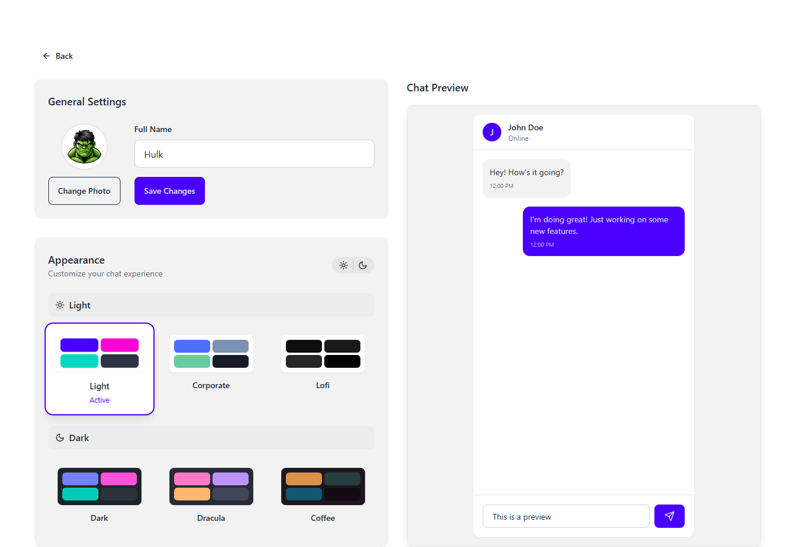

# Nexus ChatApp

A full-stack real-time chat application with React frontend and Node.js/Express backend. It features secure login, real-time messaging, AI-powered Gemini chatbot, and customizable themes. Built with Tailwind CSS and daisyUI for a modern, responsive UI.

## 🌐 Live Demo

Nexus ChatApp - https://nexus-chatapp.onrender.com


## ✨ Features

### 💬 Core Chat Functionality
- **Real-time messaging** - Instant communication between users
- **Emoji support** - Express yourself with a wide range of emojis
- **Image sharing** - Send and receive pictures in conversations
- **Message history** - Access your previous conversations
- **Online/Offline** - Also indicate unread messages
  
### 🤖 AI Integration
- **Gemini AI Chat** - Interact with Google's Gemini AI directly within the app
- Smart AI-powered responses and assistance

### 👤 User Profile Management
- **Customizable profiles** - Set your display name and profile picture
- **User authentication** - Secure login and registration system
- **Profile editing** - Update your information anytime

### 🎨 Customization
- **Theme switching** - Toggle between light and dark modes
- **Personalized settings** - Configure app preferences to your liking

## 🏗️ Project Structure
```
nexus-chat-app/
├── backend/
│   ├── node_modules/
│   └── src/
│       ├── controllers/
│       │   ├── auth.controller.js
│       │   ├── gemini.controller.js
│       │   └── message.controller.js
│       ├── lib/
│       ├── middleware/
│       ├── models/
│       ├── routes/
│       ├── seeds/
│       └── index.js
│
└── frontend/
    ├── node_modules/
    ├── public/
    └── src/
        ├── components/
        │   ├── skeletons/
        │   ├── AuthImagePattern.jsx
        │   ├── ChatContainer.jsx
        │   ├── ChatHeader.jsx
        │   ├── MessageInput.jsx
        │   ├── Navbar.jsx
        │   ├── NoChatSelected.jsx
        │   └── Sidebar.jsx
        │
        ├── constants/
        ├── context/
        ├── lib/
        ├── pages/
        │   ├── HomePage.jsx
        │   ├── LoginPage.jsx
        │   ├── ProfilePage.jsx
        │   ├── SettingsPage.jsx
        │   └── SignUpPage.jsx
        │
        ├── store/
        ├── App.jsx
        ├── index.css
        └── main.jsx
```
## 🚀 Getting Started

### Prerequisites

- Node.js 
- npm 
- MongoDB (or your database of choice)

### Installation

1. **Clone the repository**
   ```bash
   git clone <repository-url>
   cd nexus-chat-app
   ```

2. **Install backend dependencies**
   ```bash
   cd backend
   npm install
   ```

3. **Install frontend dependencies**
   ```bash
   cd frontend
   npm install
   ```

4. **Set up environment variables**
   
   Create a `.env` file in the backend directory:
   ```env
   PORT=5000
   MONGODB_URI=your_mongodb_connection_string
   JWT_SECRET=your_jwt_secret
   GEMINI_API_KEY=your_gemini_api_key
   CLOUDINARY_CLOUD_NAME=your_cloudinary_name
   CLOUDINARY_API_KEY=your_cloudinary_api_key
   CLOUDINARY_API_SECRET=your_cloudinary_secret
   NODE_ENV=development //Don't add during deployment
   ```

5. **Start the development servers**
   
   Backend:
   ```bash
   cd backend
   npm run dev
   ```
   
   Frontend (in a new terminal):
   ```bash
   cd frontend
   npm run dev
   ```

6. **Access the application**
   
   Open your browser and navigate to `http://localhost:5173` 


## 🛠️ Technologies Used

### Frontend

- **React** - UI library
- **Vite** - Build tool and dev server
- **Tailwind CSS** - Utility-first CSS framework
- **daisyUI** - Tailwind CSS component library
- **Zustand** - State management
- **React Router** - Navigation
- **Axios** - HTTP client for API requests
- **Socket.io Client** - Real-time bidirectional communication

### Backend
- **Node.js** - Runtime environment
- **Express** - Web framework
- **MongoDB** - Database
- **Socket.io** - Real-time communication
- **JWT** - Authentication
- **Bcrypt** - Password hashing and encryption

### APIs
- **Google Gemini AI** - AI chat functionality

## 📱 Key Features Breakdown

### Chat System
- Real-time bidirectional communication
- Message delivery status
- Typing indicators
- Online/offline status

## 🔐 Security Features

- JWT-based authentication
- Password encryption
- Protected API routes
- Input validation and sanitization

 ## 🤖 AI Integration

Seamless Gemini AI conversations
Context-aware responses
Natural language processing

## 🚀 Deployment

This application is deployed on **Render**.

### Deploying Your Own Instance

1. Build locally first with `npm run build` command in frontend terminal
2. Then proceed with deployment on Render
3. Create a new Web Service on Render
4. Connect your GitHub repository
5. Set the build command: `npm run build`
6. Set the start command: `npm run start`
7. Add environment variables in Render dashboard


**Environment Variables to Set:**
- Backend: `MONGODB_URI`, `JWT_SECRET`, `GEMINI_API_KEY`, `PORT`, `NODE_ENV`
- Frontend: `VITE_API_URL`

## 📸 Sample Images

Here are some screenshots and visuals from the Nexus Chat App:

### Login & Signup



### Chat Interface



### Gemini Ai Chat


### Settings & Profile


----------
